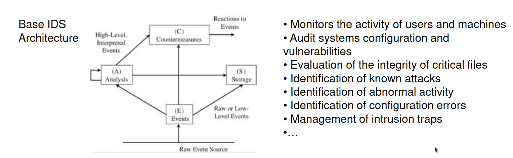

# Main Threats
- Remote access and/or modification of programs and data (includes credential theft)
- Remote program execution (malware)
- Interception and/or modification of data in transit(man in the middle)
- Data insertion in communications
- Lost of integrity in DNS
- Communication interruption (total or selective)
- New attacks explore several vulnerabilities and are more multifaceted
# Defenses
- 1º Line: Management and infrastructure planning
- 2º Line: Filtering (Firewalls)
- 3º Line: Monitoring and intrusion detection
- 4º Line: Encryption


# Management and infrastructure planning
## De-Militarized Zones and Screened Subnets

### De-Militarized Zones (DMZ)
- It is a segment or a subnetwork that establishes a certain layer of security between the organization internal network and a external network (typically the internet)
### Screened Subnets
- It is a security mechanism that works like a filter, where the internet trafic first passes by for only then beeing accessible to the internal network 
- It monitors the traffic between internet and internal network
- It inspects the traffic
- Security measure
## Network Architecture (preventive control)
- Promote the segmentation (facilitates the monitoring and management)
- Promote redudancy
- Avoid the singular points of failures
- Promote encrypted communications
## Link Encryption VS End-to-End Encryption
- Link encryption concerns the encryption of the communication channel (SSL,HTTPS,ETC..)
- Link encryption has a handshake where the encryption options are established
- End-to-End, the message is encrypted with a known algorithm from both parties (key pair)
- Both encrypt the data
## Firewalls

- Filter that protects the internal network from the outside world
- Features:
  ```
  -> Impossible to circumvent
  -> Resistant to attacks
  -> Low Complexity - facilitates the analysis and administration
  -> Oriented to level 3 of network (IP Header). It may include features of level 3
  -> Typically do not reach the app level (proxies are better suited)
  -> Several implementation strategies -> Appropriate Security Policy
  -> Attention to the default behavior:
     -> What is not expressly prohibited is accepted
     -> What is not expessly acceted it is forbidden
  ```
- Packet processing engine implemented in Linux
- *iptables* is the native app on linux to create and edit rules in all chains
  - use:
  - iptables-save
  - iptables-restore
  - iptables-apply
  - iptables-persistent
- For IPv6 use ip6tables
- Packet Filtering Gateway or Screening Routers(2/3)
  ```
  -> Simpliest Solution, filters out addresses and ports (transport level)
  ```
- Stateful Inspection Firewall (2/3)
  ```
  -> Maintains communication state information between consecutive packets
  -> Allows detect attacks based on packet fragmentation
  -> More complex rules, allowing to analyze payload
  ```
- Application Proxy Gateway or Bastion Host (4)
  ```
  -> Acts as a particular application Server
  -> Decides what commands/data will be passed to the actual server and what data is sent out
  -> It might even strengthen the authentication function
  ```
- Guard(4)
  ```
  Typically is a more "intelligent" bastion host, with a capacity of (for example):
  - Decide what services request, depending on client features (location,previous uses,etc..)
  - Dynamically limit data transfer
  - Run an anti-virus on embedded files
  Policy Definition is a very complex task
  ```
- Personal Firewalls (2/3)
  ```
  Complement the work of (organizational) firewalls "finely" protecting each computer
  Allow Personal Security Policies but it is necessary to manage the rules
  Consume personal machine resources
  ```

### Limitations
- Only secure if the firewall filters all the network perimeter
- Information that comes out (legitimately) the perimeter is not secure
- Configuration must be carefully planned and managed
- The most visible component of the network, therefore more subject to attacks (defence must be taken seriously)
- Malicious data, concealed within legitimate communications, cannot be avoided - defences at the app level..
- Limited capacity with encrypted traffic
## Intrusion Detection Systems (IDS)

- IDS types:
  - Signature Based (SB)
    ```
    Verification of patterns associated with known attacks (SURICATA;SNORT;IDIOT;STAT,..)
    ```
  - Anomaly Based - Heuristics
    ```
    Builds a model of normal acceptable behavior and signals everything that does not match this model
    ```
- IDS types (characteristic function)
  - Target to networks (NIDS)
    ```
    A single component that monitors network trafic
    ```
  - Target to computers (HIDS)
    ```
    Run on a computer 'Observing' their behavior
    ```

