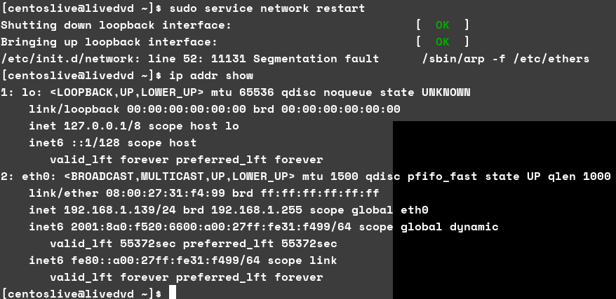
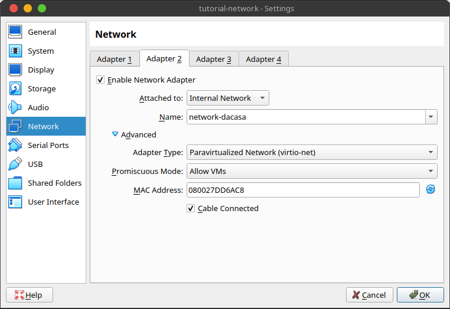
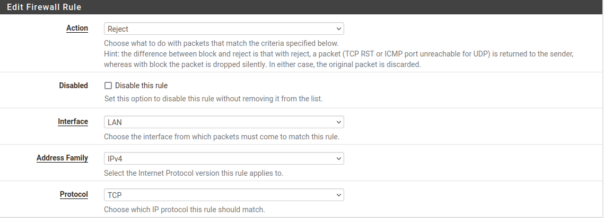
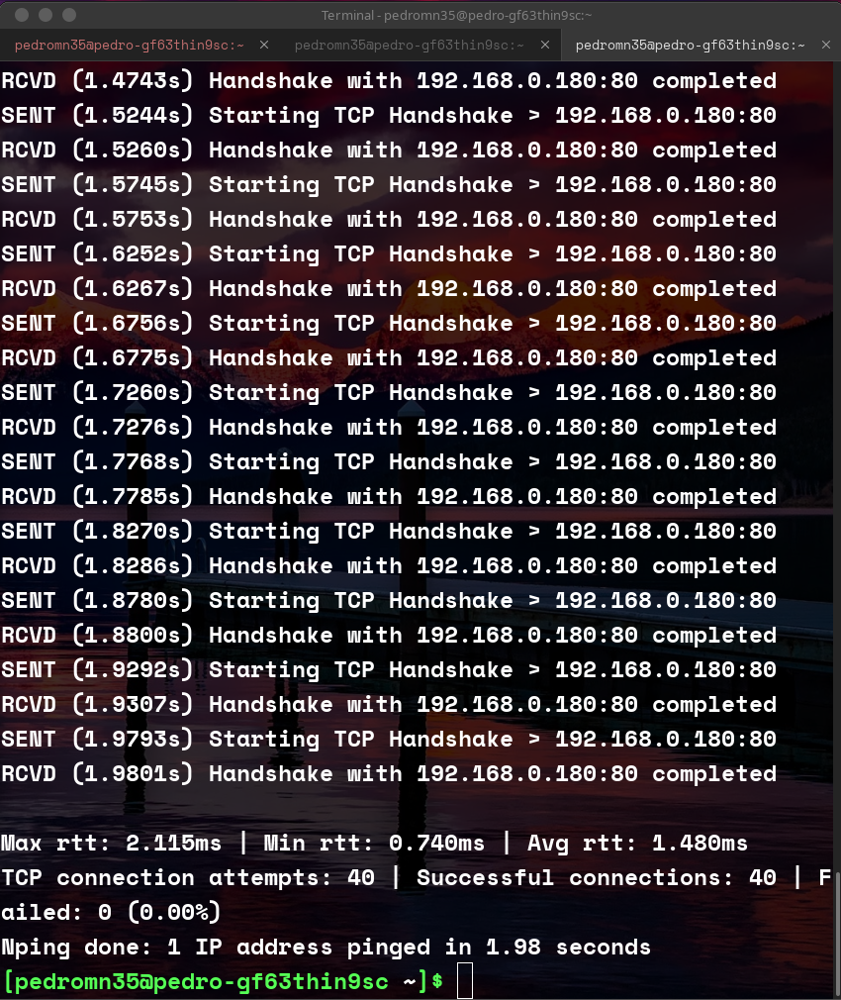
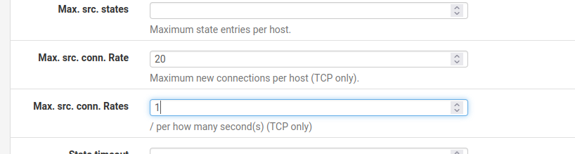

# TASK 2 (SERVER SETUP)


1. Install FTP service
- Installation of FTP service


- Enabling httpd


- Enabling sshd


- Enabling vsftpd


- Starting the Services
  


- We runned the command 'netstat -l | grep "tcp"'

- We forgot to start every service, we only had them enabled but we needed to start them all

- We noticed that the ftp service was up
- Also that the ssh service was up
- And also that http service was up
- Next step has making connections to that services
 


- The Http Connection was made via browser using "http://localhost", it is a normal website
 


- The Fttp Connection was made via browser using "ftp://localhost", it is a service for uploading files


- The ssh connection was made by console and since we are in virtualBox, we needed to change the user password to correctly type the password to enter the service as you can see in the image
- SSH is to remotely have access to the computer console
1. Executing the command "system-config-firewall-tui"


- We enable the firewall and then press OK 
- Later we confirm the new configuration, which will lead to a blue screen that disappears after a few secounds


3. Execute iptables -L -v


First of all we need to know that:
- "iptables -L -v" command on linux is used to list the current firewall rules in the iptables packet filtering system, along with packet and byte counters for each rule.
- It shows the Chains which can be either Input,Output and Forward. Input, means that the rules are being applyied to the incoming network traffic destined for the local system(they determine if we accept or reject incoming connections to the local system). Output, means that the rules are being applyied to the outgoing packets (The packets considered are responses). Finally forward, means that the rules are being applyied to the traffic that is not meant for you, which passes by you for you to forward to another machine (Ex: Another machine sending a message to a Virtual Machine that is placed inside your computer, you computer will be something like a router that is passing out the message between the 2 entities which in this case are the external machine that does not make part of the network that you have with your virtual machine and the virtual machine itself)
- The chain itself can have a policy of ACCEPT, REJECT and DROP but rules inside of the chain prevail in relation to this policy
- Also, we have another kind of information which is displayed by chains such as: pkts (Number of packets that have matched a specific rule since the counters were last reset), bytes (Total size of the packets in bytes that have matched the rule since the counters were last reset), target (The action that will succed upon taking the rule matching which can be ACCEPT when accepted, REJECT when rejected and intended to return a error message and DROP when rejected without confirming that it got rejected), prot (This is the protocol which can be TCP,UDP,ICMP,etc..), opt (Which refers to additional options and flags associated with each rule), in (which is the interface from where the packet will be transmited), out (which is the interface for where the packet will be transmited), source(The source ip of the transmition), destination(The destination ip of the transmition) and also a empty header which stands for additional information
- By analyzing the image we can see that: For chain INPUT we have 5 rules. 
- Rule number one got 132 "pkts", 11992 bytes of size and it becomes accepted when it matches the following rules: all protocols match, when the "in" and "out" headers that mean interfaces are anything, the "source" and "destination" are anywhere and when the connection represents connections that were already maded previously accordinly to the aditional information "state RELATED,ESTABLISHED". 
- Rule number two got 0 "pkts", 0 bytes of size and it becomes accepted when it matches the following rules: the prot is "ICMP", "in" and "out" are anything and "source" and "destination" are everywhere.
- Rule number three got 1 "pkts", 184 bytes of size and gets accepted when it matches the following rules: all protocols, when the "in" is "lo", out anything and "source" and "destination" comes from everywhere.
- Rule number four got 0 "pkts", 0 bytes of size and gets accepted when it matches the following rules: protocol is "udp", "in" and "out" are anything, "source" is anywhere, "destination" is on ip "224.0.0.251" and additional information is "state NEW udp dpt:mdns" which stands for representing a rule that matches incoming UDP packets with a destination port (dpt) of mdns. "mdns" refers to multicast DNS, which is used for service discovery in local networks. This rule is likely allowing incoming multicast DNS traffic.
- Rule number five got 0 "pkts", 0 bytes of size and gets rejected everytime it the following rules: anykind of protocol, anykind of "in" interface and "out" interface, anytime it get source and destination from anywhere and its additional information is "reject-with icmp-host-prohibited", which stands for the action to be taken when a packet matches the rule. In this case, the action is to reject the packet and send an ICMP "host-prohibited" message back to the sender. This is a common rejection message used to indicate that the destination host does not accept the incoming connection.
- In case of the Chain FORWARD, we have only one rule.
- This rule has 0 "pkts", 0 bytes of size and gets rejected anytime when the following rules match: anykind of protocols, "in" and "out" are anything,"source" and "destination" are anywhere and the aditional information stands for sending a "icmp-host-prohibited" message. 
- In the case of the Chain OUTPUT, it does not have anykind of rule

- In terms of security as you can see, we connected the host to the machine via a bridged adapter
- 

- By doing ip show in the centos we can see that the ip address inside the host network is 192.168.1.139
- We can even ping the machine

- Despite the ability to ping it, we do not have access to any of the services displayed previously, shuch as ssh, http and ftp


- As you can see we can see the content of our ftp server in the machine but in the host machine we cannot
  


- This attemps correspond to the INPUT Chain, which are the incoming requests


- Answering to the question of security, i think that the level is good. The rules that take effect are the ones that match first, so as we can see in the image upper when i try to make contact from outside the machine i will always be denied, atleast if i don't use icmp protocol or i am a service discovery.
- Denote that the first rule is only for already established connections 
- Also, note that you only can make connections locally because you have a rule that only enables you to do so in the "lo" interface, which is localhost where the host machine does not make apart of, it only makes part of the eth0 which stands for ethernet network interface provided by the bridge adapter that links the wlo to the machine
- Icmp is enable ,thats why i can ping the machine and i cannot access other services


- As you can see, when we try to access using the host machine it throws the error given by the the additional information on the iptables rules. This information was given by wireshark
  

- In order to make our life easier we made a connection by ssh to the machine throught the host
- To enable ssh we added the rule before the rule of rejection, because if we added after, it would match the reject rule first
- To do this we used the command "sudo iptables -I INPUT 1 -i eth0 -p tcp --dport 22 -j ACCEPT"
- "-I INPUT 1" for inserting in the position 1
- "-i eth0" to put the rule to allow the request to come from eth0 interface
- "-p tcp" to allow the protocol tcp
- "--dport 22" to allow at port 22 because it is the port of the ssh
- "-j ACCEPT", to make it ACCEPT in those conditions 

- Now we can for sure link the ssh protocol as you can see in the image above.. for the simplicity we will pursue using the machine by ssh because of comodity
 

- As you can see we saved our tables in a file caled iptables.dump


- Now empty the tables


- This is how we restored the table out


- In this step we disable the firewall
  


- If we turn the firewall of, we stop having the rules that we once had. This becomes very dangerous because, we will not filter any kind of request, which can be something critical with some kind of services that we may have.
  


- We enable firewall again


- Rules are back after firewall restored

# TASK 2.2 (CLIENT SETUP)


- We setted a client with black arch linux, where we pinged the server machine


- These are both client and server network interface details


- We made a nmap check into the server host. Since the machine rules don't expose any of the services we activated in the previous tasks, we got no information about opened ports. 


- After reading some of the docs, we provided the flags "-p0- -v -A"
- "-p0-" flag is intended to scan every single port of the target
- "-v", print version number of the service we are attacking
- "-A", it is for the OS detection
- The output displayed says "Completed NSE at 17:07", because it is confirming that the script was used


- We runned "w3m" against the server
- Since the machine has rules that stop us to access the http server that we have on that machine, we were unable to execute the command


- We runned "ftp" against the server
- We also cannot access this service because of the server rules


- We runned "ssh" against the server 
- We also cannot access this server because of the server rules
- We cannot access any of this services because of the rules settet previously, like we said and since these are incoming request this means we will be using the INPUT Chain rules. If we look again to the table we note that, since the behavior is to use the rule that matches first the given request, the request will only go to a different rule when the protocol is ICMP, which is the protocol used for the ping command (the only operation we could do). Other requests besides this and a request for service discovery, will be denied by the last rule which matches every request that we can possible make, since it reaches every protocol, every interface and every source and destination. 
# 2.3- Fine Tune


- In this step we go again to "system-config-firewall-tui" > customize and trust every service that we previously activated (ftp,ssh and http)


- This is the window where you can select a interface to give full access


- This is the window to mask the interface out, which tells you the range of ips that you can have in the subnetwork


- This window is to create a tunneling between 2 systems


- Which components of the ICMB will be filtered by the firewall
- In this window we selected all besides the Echo Request (ping) like instructed


- This is the window of the custom-rules


- Those are the rules generated by the custom rules
- The statement says for ping the server after this, which we did but the response is exacly the same because the host is rejecting incoming requests such as: echo-reply, destination-unreachable, parameter-problem, redirect, router-advertisement, router-solicitation, source-quench and time-exceeded. So, in that behalf i still can do a ping to the machine because they are allowing it and also because it is a echo-request and not a echo-reply.


- As you can see in this image, the only upcoming request that the host receives (192.168.1.139) is a echo-request
- The echo-reply is a outgoing


- We tryied w3m for acessing a website via cmd and we achiedved to link to the website of the CentOS


- After trying to use ftp, we now see that we can make a connection to it despite not beeing able to login


- With nmap we now can see which services are open and in which ports they are open
- Comparing to the last try, we whould notice that we could't extract any information before and now we can


- This is the nmap with more options where we could get some ways to break into some of the services, their versions and also we can see some information about the OS.


- This is the ping maded from the host(server) to the client
- Answering to the question that if i would expect such behavior Yes, because altought we have a rule to deny echo reply's, we still have a rule above that accepts every request which we made a connection previously (the first rule)


- Answering to question 8, the last activities that we done have been sucessfully acomplished because of the the custom rules that we setted previously. First, pinging from the client to the server is achieved sucessfully because like i said we reject echo reply's, but not echo requests which are then enabled more ahead (with the allowance of the ICMP protocols to every interface and from anywhere to anywhere) and since the first rule to apply is the one to execute this operation will be sucessfull. Secound, w3m service is enabled because we allowed it alost at the hand. Third, nmap will now be able to get all the 3 services that we enabled, that you can see in the rules that will be acessible. Finaly, pinging from the server machine to the client will be just fine, since we enable all the connections in all protocols, from anywhere to anywhere and in all the interfaces in the first rule, so it will not be a problem despite receiving a incoming packet echo reply. We would only be denied if the client sent a echo reply request without a echo request request.
# 2.4 Writing rules

- At 2.4 we erased the ip table


- Those are the new rules, which default policies are DROP
- INPUT and OUTPUT chains where the linkage were already maded are accepted everytime for every protocol, to every interface, from and to everywhere.
- Every operation in LO either OUTPUT and INPUT are accepted
- DHCP is enabled in the RULE D, by enabling udp to OUTPUT channel with destiny ports 67:68 and source ports 67:68
- For dns we enabled either tcp and udp for destiny port 53 in both to output chain
- For ssh we enabled port 22 ,with in "eth0" and also with protocol tcp to input chain
- For Http we did the same but for port 80 to input chain
- For Https we did the same but for port 443 to input chain
- For SMTP we accepted port 25 to output chain
- For NTP we accepted port 123 to output chain


- In this step we restore the table with the configurations we created previously


- These is the result from the rules above


- We reseted the network service and we still get correctly the automatically self-given ip address from eth0, so dhcp its working just fine


- Also, after a quick research on the internet, we founded how to flush the dns cache
- After doing so, we still be enabled to ping the host of google.com

# 3 Tasks - fw (advanced)


- To start this task, i installed the pfSense image in a debian linux machine 64 bits
- Before initializating it, i made a configuration at network level, enabling bridge adapter in the first adapter to wlo1 and in the secound adapter i enabled a internal network called "network-dacasa"


- Also, we changed the type to paravirtualized network (virtio-net) and the promiscuous mode got changed to allow vms


- For the other 2 machines, more precisely the centOS 6.9 (The machine that served as server in the last chapter) and black arch linux (the machine that served as client in the last chapter), we configured the network to be exacly as the secound adapter in the "firewall" named machine.


- We installed pfSense in the virtual box with the default options provided by a website
- The machine has 10gb of internal memory, 1gb of ram and 2 processors
- When installing we selected the keyboard we wanted to, which in my case is spanish because why not
- Then it asks how do you want to install it in terms of memory and i selected the secound option which auto partitions the memory and do not bothers me at all
- It downloads what it needs and then it asks if i want to log into the console which i do not want
- Finally it asks for reboot


- As you can see, on entrance it asks which interfaces i want
- For the first option (WAN), i selected the bridge adapter (em0)
- For the secound option (LAN), i selected the internal network


- These is the atribbuted ips 
- For the WAN, as expected the ipv4 is 192.168.1.143
- For the LAN, we have the ip address as 192.168.1.1


- We configured the ip address of the LAN network, in order to put the LAN in a different network of the WAN. We setled the previous IPV4 (192.168.1.1) to another subnet IPV4(192.168.2.1), with of course 24 bits for the submask, with ip ranges of 192.168.2.1-192.168.2.20 which should be more than enought since we only have 3 machines and we enabled the DHCP.


- As you can see after setting the configuration above, after restarting the network manager in the black arch linux we are able to have automatically the ip address assigned by the network (192.168.2.2)


- The same goes to our centOS 6.9 machine, which after restarting the network manager we got the new automatically generated ip address (192.168.2.3)


- As you can see we have access to all the machines within the network but we cannot access the internet, in the black arch linux


- As you can see we have access to all machines but not to the internet in the centos machine


- The pfsense has access to the machines and also the internet


- After we encountered the internet communication issue, we went into the pfsense documentation
- It said for us to loggin in the web interface using the LAN pfsense ip address (192.168.2.1)
- The username is "admin", the password is "pfsense"
- After further analysis and a lot of digging, we founded that in the rules section for wan, we had 2 rules blocking connections to private networks and bogon networks
- After disable this rules, we successfully had internet connection in either the black arch linux and also the centOS


- As you can see we solved the problem for both machines, now we have plenty access to the internet :)
- Unfortenelly, we solved the problem and the comment to the default settings was not made because we tought that the internet connection has required
- In the default options in the WAN section the options selected were block private networks and bogon networks
- In case of block private networks, that would block private networks such as "172.16.0.0/12", "192.168.0.0/16" and "192.168.2.0/24" (this is ours). Which got us forbidden of access the internet in our LAN machines.
- In case of block bogon networks, that would block networks such as "192.0.2.0/24", networks that are supposely just for testing purposes and enviroments.
- This settings are good if we want to block the lan machines from accessing the internet from the WAN 
# Impeding access to a website

- We got the ip ranges for facebook from blackarch


- We searched for a website that calculates the CIDR from the ip addresses and this was the result


- Access to the facebook page from black arch linux


- We went to firewall > Rules > LAN as instructed


- We created an new rule where we reject TCP


- We also put the option of source to LAN net to the option becoming enabled from the LAN net


- We putted the destination options as the destination be the network and the CIDR is the one that we calculated in the previous website (157.240.0.0/16)


- We also enabled logs and give a description to the rule
- After that we saved the options and applied the changes :)


- After the rule taking effect, it becomes impossible to access the facebook


- This is the state recorded by the status indicator


- We changed the action to block
- We will save and apply the rules as instructed


- After the block, we got infinite loading
- This is due to the nature of rejecting and blocking a host. Case we reject, we send an error message which in block we don't send anything, so because of that we will eventually reach connection timeout

In pfsense we can limit the trafic to a single host instead of the whole network. And so it goes to ports. (comments to this)

-> Advantages

    - We have the possibility to be more precise to what we want the user to see or not
    - We have more control over the network
    - We can monitor particular trafic
    - We can stop different services within the same host

-> Disadvantages

    - Complexity
    - Increased administrative overhead
    - The host can switch services ports or the ip within that network and a rule that once worked for blocking a particular service, no longer works or becomes useless


- When checking the logs in status > system logs > firewall we cann see the previous activity
- It says the time that it occured
- it mentions the description of the rule we implemented (if you remember, above we put the description of the rule as "No more facebook!!")
- It says the source, either the ip and the port
- It says the destination, either ip and port
- The protocol is TCP
# Scheduling Rules

- We went into firewall > Schedules
  


- We gave a schedule name
- We gave a description
- We selected all the days, by selecting the header of the callendar which removes the month restriction
- We selected the time that was asked (10am to 4pm)
- We also have a time range description
- After all that we clicked uppon the "add time", which added it into the configured ranges like you see in the secound image
- We saved and the rule appears clearly in the third picture


- We went into firewall > rules > edit button (of the rule we created before)
- Scrolled down into extra options
- Selected "Display advanced"
- Scrolled down once again to find Schedule field
- Select the schedule rule we created before
- We saved and applyied the changes


- As you can see after saving the rule appears in the Schedule header


- We changed the range to 5pm to 9pm
- Since at the time it is 7pm, it did not work


- We changed the range to 9am to 11am
- Since at the time it is 7pm, it did work


- Despite the rule making effect or not, the rules still pass by even if the action does not take effect as you can see
  
# Web Server Public
In this section we went into the port forwarding section by going Firewall -> Nat. After entering we applied the following rules like suggested in the description of the task: (Know that we enabled the httpd service in the centOS image, which is one of the internal network participants)

- The interface is WAN.
- The protocol is TCP.
- Destination is WAN address.
- Destination port range is 80
- Redirect target ip is single host and the ip address is the ipv4 of the centOS image ("192.168.2.2").
- Redirect target port is 80.
- Filter rule association is "Add associated filter rule", which makes everything for us.

Unfortunely, even after configuring it like this, we were not able to access this web page from the exterior.. after further look ups we founded that our firewall was denying it as you can see in the logs:


In order to solve this, we went to the firewall rules relative to the WAN and enabled every single connection, from anywhere to the port 80 of the WAN interface. This way we finally got the intended result


As you can see, i got the intended result which is the access to the internal network by the WAN network, which forwards all the trafic to the internal network using the public ip address "192.168.1.143:80". Note that i connected to it by my host machine.

# Limit Number of Connections
In regular operation we should not have more than twenty connections requests per secound.

Denote that in this part of the tutorial and since i changed my wifi, the dhcp created a new ip address. Instead of the 192.168.1.143, i am now with a ip address 192.168.0.180.

To simulate a DDOS attack, we used a tool called nping. The command is as follows:
```
sudo nping -tcp-connect -p 80 -rate=20 -c 40 192.168.0.180
``` 
- "-tcp-connect" stands for a tcp connection
- "-p" stands for a port
- "-rate" is the number of packages per secound we are sending
- "-c" is the number of requests we will produce
- Finally we put the ip address that we are making this request against

This is what came from the wireshark:

- We can see that the trafic got completely full of this requests
- There were cases of duplication of packets
- Retransmissions also happend
- There are no signals of failure, which we will see in the output of the console


- Max rtt was 2.115ms
- Min rtt was 0.740ms
- Avg rtt was 1.480ms
- From 40 attemps 0 failed

For testing purposes, we tryied to somehow make requests fail.. By testing a bunch of combinations we did this one and founded more or less a minimum combination to make some connections fail


```
sudo nping -tcp-connect -p 80 -rate=100 -c 350 192.168.0.180
```
As you can see to reach a fail we both increase the number of requests per secound with "-rate" flag and also increased the number of connections with "-c". The rate got increase from 20 to 100, and the number of connections increased from 40 to 350.


As instructed we went into the WAN rule, responsible for allowing the connections to the page and changed to a max of 20 requests per secound

Now to check the effects, we will run a command as so:
```
sudo nping -tcp-connect -p 80 -rate=30 -c 30 192.168.0.180
```

As you can see now 30% of the requests were not full-filled


If we look into the firewall logs, we can see that a rule called "virusprot" taked place.


As mentioned what the rule does is to put the ip address that violated the rule into a forbidden ip address table as you can see here in the Diagnostics > Tables and virusprot opt


Without crossing the boundaries (using 10 requests per secound with 30 attemps, we see that every request is settled)


When we cross boundaries, as you can see we get denied in some point.
This time the command we used was:
```
sudo nping -tcp-connect -p 80 -rate=100 -c 30 192.168.0.180
```
we got another 30% denied

If we check out the wireshark

We can see that the host is asking for retransmission and is getting no response at all from the server.. which means that the pfsense firewall is not rejecting but blocking the communications because it does not even response back
